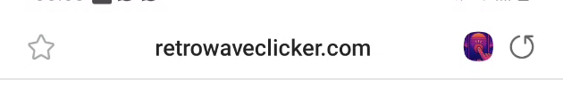

# Кликер (Android)

Проект из себя представляет кликер с уровнями, статистикой и графиком.

Также, из дополнительного, реализовано открытие приложение через диплинк, есть темная тема)

## Скриншоты:

##### Вертикально:

##### То же самое, но горизонтально:

##### Открытие статистики через диплинк:

